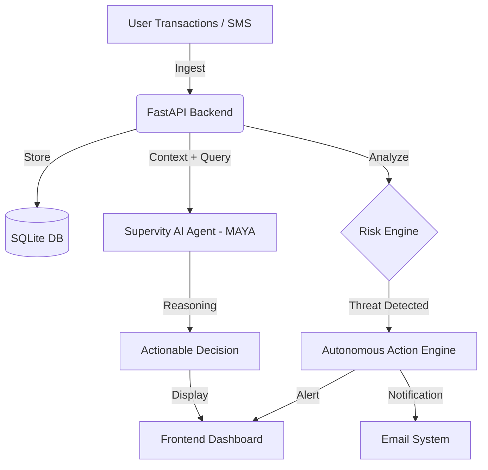
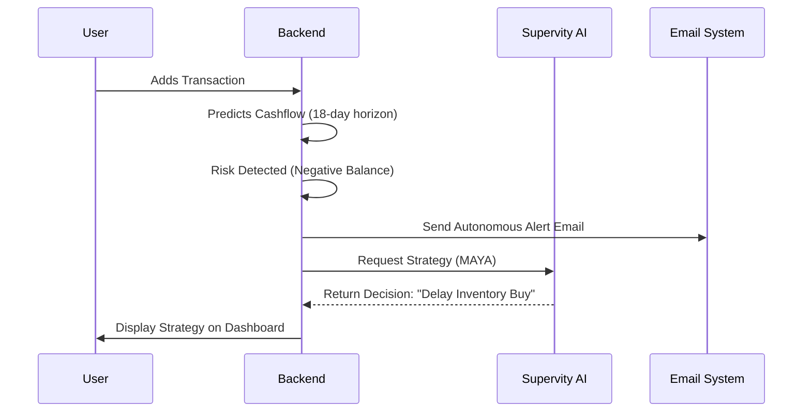

# VyapaarMind AI
### Smart Financial Decisions for Every Business

**VyapaarMind AI** is an autonomous AI CFO for SMEs that tracks cashflow, predicts risks, and takes intelligent financial actions before you even ask.

---

## The Problem Statement

Millions of small businesses don’t fail because they lack revenue — **they fail because they lack financial intelligence.**

Reality for most SMEs:
*   **No Structured Accounting:** 80% rely on memory, WhatsApp, or paper notebooks.
*   **Reactive, Not Proactive:** They check their balance only when a payment fails.
*   **The "Invisible" Loss:** Poor timing and guesswork lead to missed opportunities and cashflow collapses.

> **"Money flows… but intelligence doesn't."**

## Why This Matters
*   **₹50K–₹2L Annual Losses:** Typical SME loss due to poor financial planning.
*   **Cashflow Collapse:** 1 out of 3 SMEs struggle to pay employees on time.
*   **High-Risk Decisions:** Investing in inventory or hiring based on "gut feeling" rather than data.

---

## The Solution: Autonomous Intelligence

VyapaarMind AI is **NOT** just another expense tracker or a static dashboard. It is an **Autonomous Financial Intelligence System**.

It doesn't just show you what *happened*; it tells you what *will happen* and takes action to prevent it.

### Core Differentiators
1.  **Autonomous Action Engine:** Detects risks (like upcoming low balance) and triggers alerts/emails automatically.
2.  **AI CFO — MAYA (Supervity):** A context-aware reasoning engine that understands your specific business patterns.
3.  **Future Simulation Engine:** Test "What If" scenarios before spending a single rupee.
4.  **Auto-MAYA:** AI triggers its own decision-making process without waiting for user input.

---

## System Architecture

## Autonomous Flow

---

## Key Features

| Feature | Description |
| :--- | :--- |
| **Smart Dashboard** | Real-time visibility into Income, Expense, and Net Profit. |
| **Predictive Intelligence** | Forecasts burn rates and predicts "Day Zero" for cashflow. |
| **Risk Detection** | Automatically flags overspending and unstable patterns. |
| **Automated Alerts** | Professional, bundled email notifications for critical signals. |
| **AI CFO (MAYA)** | Powered by Supervity for human-like financial reasoning. |
| **Future Simulator** | Simulates ROI on investments before you commit funds. |
| **Auto-MAYA** | The first AI CFO that triggers itself to save your business. |

---

## Tech Stack

*   **Frontend:** React, TypeScript, Tailwind CSS
*   **Backend:** Python, FastAPI
*   **Database:** SQLite
*   **AI Engine:** Supervity AI 
*   **Reasoning:** Groq
*   **Automation:** Email Engine

---

## Database Design

*   **Users:** SME Profile & Preferences.
*   **Transactions:** Categorized income/expense logs.
*   **Alerts:** De-duplicated risk signals.
*   **Decisions:** Historical recommendations generated by MAYA.

---

## Real World Impact

*   **Survival:** Helps SMEs survive the "Valley of Death" by stabilizing cashflow.
*   **Financial Literacy:** Democratizes high-level CFO intelligence for the local shopkeeper.
*   **Scalability:** Designed to handle millions of transactions across diverse SME sectors.

---

## Future Scope

*   **UPI/Bank Integration:** Direct hook into real-time transaction streams.
*   **GST Insights:** Automated tax planning and filing alerts.
*   **Credit Scoring:** Uses alternative data (cashflow patterns) for better loan eligibility.

---

## Final Positioning

VyapaarMind AI is not a tool. 
**It is a startup dedicated to making SMEs un-killable.**

> **"Most systems wait for users to ask questions... VyapaarMind answers before the question is even asked."**

---
Created with **❤️** by **Vivek Goud Adula** for **CodeQuest 2026**.
